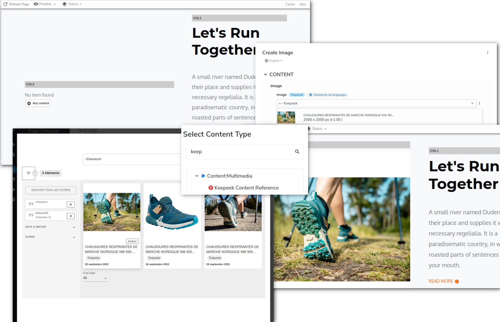

# keepicker
This module contains the implementation of the Keepeek Content Picker for Jahia 8.1.x.x

With this module, a contributor can easily add a Keepeek media asset to a Jahia page.

>If you want to be able to select media content from Jahia **and** Keepeek you can use the [DAM Selector][DamSelector] module.

Note: Only image and video are handled by this module

- [Module content](#module-content)
- [Quick Start](#quick-start)
    - [Deploy the module](#deploy-the-module)
        - [From the source](#from-the-source)
        - [From the store](#from-the-store)
    - [Post Install (optional)](#post-install-optional)

## Module content

This module contains:
* The definition of a `Keepeek Asset Content Reference` content ([definition.cnd][definition.cnd]).
* A React application : `Keepeek Content Picker` ([KeepeekPicker.jsx][react:index.js]).
  This application is a custom jContent SelectorType (aka picker) and is used to pick a Keepeek asset.
* A *light* implementation of an External Data Provider (EDP) named
  `Keepeek Asset Provider` ([KeepeekDataSource.java]).

Not covered in this module:
* CKEditor Keepeek media picker

## Quick Start

### Deploy the module
The module can be installed in 2 ways, from the source or from the store.
#### From the source
1. Download the zip archive of the latest release.
2. If you already know your Keepeek configuration (API key, site, and host) you can update the default
   configuration about Keepeek. Update properties in the [keepicker_credentials.cfg][mount.cfg] file.
1. Go to the root of the repository.
1. Run the `mvn clean install` command. This creates a jar file in the *target* repository.
   > you must have a **java sdk** and **maven** installed
1. In jContent, go to `Administration` panel.
1. In the `Server` section, expand `Modules and Extensions` and click `Modules`.
1. From the right panel, click `SELECT MODULE` and select the jar file in the *target* repository.
1. Finally, click `UPLOAD`.

#### From the store
1. In jContent, navigate to `Administration`.
2. In the `Server` section, expand the `Modules and Extensions` entry and click `Modules`.
3. From the right panel, click `Available modules` and search for **keepeek**.

4. Click the install icon ![201] in the right of the package to download and install the module.
5. Wait until the module is loading.

#### Check install
If the module is properly deployed you should find it in the `Installed modules` section.

If you have installed the module from the store or if you didn't configure the properties
in the [keepicker_credentials.cfg][mount.cfg] file before to build the module, you must do the post install
to have the Keepeek provider starting.

>Don't forget to enable the module for one of your project

### Post Install (optional)
>Skip this section if you have already configured the [keepicker_credentials.cfg][mount.cfg] file during the *install from the source*
process.
> This configuration doesn't require a server restart.

To request the Keepeek server, you have to configure the module with your Keepeek API access information.

To set up your Keepeek API access:
1. Go to  jahia tools (*https://\<jahia host\>/tools*).
2. From the tools UI, click `OSGI console` under **Administration and Guidance**.

   ![][0070]

3. In the top menu expand the entry **OSGI** and click **Configuration**.

   ![][0072]

4. Look for `org.jahia.se.modules.cloudinary_picker_credentials` and click on it.

5. Finally, update the appropriate properties and save your changes.

   ![][0071]

6. If all the properties are set correctly, the provider should start,
   and you should see the `cloudinary` key in the list of External providers.

   ![][031]

7. Now, you should be able to create a new `Keepeek Content Reference` content or select Keepeek as
a provider if you use [DAM Selector][DamSelector].

[031]: ./doc/images/031_install_completed.png

[010]: ./doc/images/CloudyArchi.gif
[002]: ./doc/images/CloudyContentRef.png
[003]: ./doc/images/CloudyDemo.gif

[0070]: ./doc/images/0070_OSGIConfig.png
[0071]: ./doc/images/0071_OSGIConfig.png
[0072]: ./doc/images/0072_OSGIConfig.png
[201]: ./doc/images/201_modules_download_icon.png

[mount.cfg]:./src/main/resources/META-INF/configurations/org.jahia.se.modules.keepicker_credentials.cfg
[definition.cnd]: ./src/main/resources/META-INF/definitions.cnd
[react:index.js]: ./src/javascript/KeePicker/KeePicker.jsx
[KeepeekDataSource.java]: ./src/main/java/org/jahia/se/modules/dam/keepeek/edp/KeepeekDataSource.java
[DamSelector]: https://store.jahia.com/contents/modules-repository/org/jahia/se/modules/dam-selector.html